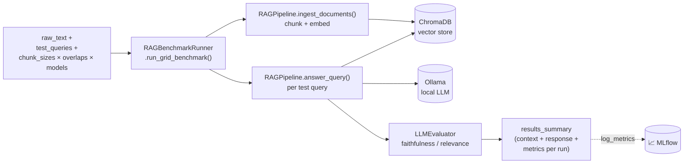

# 🔍 RAG Benchmark Lab


> Flagship laboratory of the [LLMOps Labs](../../LLMOpsPlatform/llmops-platform) ecosystem — grid-searches RAG configuration (chunk size, chunk overlap, embedding/generation model) and reports hardware-aware, MLflow-tracked quality and latency metrics.

## Problem & Goal

RAG pipeline quality depends on chunking parameters and model choice in ways that aren't obvious without empirical testing, and on constrained edge hardware (this lab is developed against a 4GB-VRAM GPU) the latency/VRAM tradeoff matters as much as raw accuracy. This lab automates that grid search: give it a knowledge base and a set of test queries, and it evaluates every combination of chunk size × chunk overlap × model, scoring each run for faithfulness, relevance, latency, VRAM usage, and token throughput.

## Architecture



Each grid cell (`chunk_size` × `chunk_overlap` × `model`) becomes its own isolated ChromaDB collection so runs don't leak context into each other, and reports:

- **Quality**: `avg_faithfulness`, `avg_relevance` (via `llmops_common.eval.evaluator.LLMEvaluator`)
- **Hardware profiling**: `avg_tps` (tokens/sec, derived from Ollama's `eval_count` / `eval_duration`), `avg_ttft_ms` (time-to-first-token, from `prompt_eval_duration`), and `vram_mb` (via `nvidia-smi`)
- **Contract fields**: `context` / `response` from the run's last query, so downstream DAG nodes (e.g. `FaithfulnessRelevanceScorerNode` in LLMOps Studio) have real content to re-score rather than empty strings

## Two Evaluation Modes

| Endpoint | Purpose |
|---|---|
| `POST /benchmark` | Grid search over chunking/model combinations against ad-hoc test queries — exploratory tuning |
| `POST /batch-evaluate` | Regression test against a fixed **golden dataset** (`data/benchmark/golden_dataset.json`, sourced from SQuAD v2.0 via `scripts/prepare_squad.py`), scoring **strict format adherence** against the Finwise neuro-symbolic label contract in addition to standard RAG metrics — this is the CI-style regression check |

## Quick Start

```bash
# 1. Bring up shared infra (Ollama, Chroma, MLflow)
cd ../../LLMOpsPlatform/llmops-platform && docker compose up -d ollama chromadb mlflow

# 2. Install
cd ../../RAGBenchmarkLab/rag-benchmark-lab
python -m venv .venv && source .venv/bin/activate  # .venv\Scripts\activate on Windows
pip install -e .

# 3. (Optional) regenerate the golden dataset
python scripts/prepare_squad.py

# 4. Run the API
uvicorn rag_benchmark_lab.api:app --reload --port 8002
```

Or as part of the full stack: `docker compose up --build` from `LLMOpsPlatform/llmops-platform` (see the [platform README](../../LLMOpsPlatform/llmops-platform/README.md)).

Interact with it either directly via `curl`/the API docs at `http://localhost:8002/docs`, or through the **RAG Benchmark Lab** / **Batch Evaluation Lab** tabs in the [Studio UI](../../LLMOpsUI).

## Extension Points

- **LLM Provider**: swap Ollama for a cloud endpoint via `llmops_common.client.factory.get_llm_client` / `BaseLLMClient`.
- **Vector store**: `RAGPipeline` wraps `ChromaClient`; swapping to FAISS or Qdrant means implementing the same thin interface.
- **Label contract**: the format-penalty check in `/batch-evaluate` is currently tuned to Finwise's `P_x_V_y` decile-token contract — generalize `BatchEvalRequest`'s validation logic to reuse this lab's grid-search machinery for other structured-output contracts.

## Known Limitations

- Grid search runs sequentially — an N×M×K grid takes N×M×K sequential inference passes, no parallelism yet.
- VRAM measurement via `nvidia-smi` assumes an NVIDIA GPU is present; it degrades to `0.0` silently otherwise (see `get_vram_usage_mb`).
